# 🎨 DIAGRAMMES MERMAID INDIVIDUELS - WILD TRANSFER

Diagrammes séparés et optimisés pour copier-coller directement sur mermaidchart.com.

---

## 1️⃣ CAS D'UTILISATION - ACTEURS ET RELATIONS

```mermaid
graph TB
    %% Définition des acteurs
    V[👤 Visiteur]
    U[🔐 Utilisateur]
    P[💎 Premium] 
    A[👮 Admin]
    E[🔗 Externe]
    
    %% Systèmes externes
    S[💳 Stripe]
    M[📧 Email]
    C[🤖 Cleanup]
    
    %% Cas d'utilisation groupés
    subgraph AUTH["🔐 AUTHENTIFICATION"]
        UC1[S'inscrire]
        UC2[Se connecter]
        UC3[Réinitialiser MDP]
    end
    
    subgraph FILES["📁 FICHIERS"]
        UC4[Upload temporaire]
        UC5[Upload permanent]
        UC6[Télécharger]
        UC7[Supprimer]
    end
    
    subgraph SHARE["🤝 PARTAGE"]
        UC8[Partager fichier]
        UC9[Générer lien temp]
        UC10[Accéder lien]
    end
    
    subgraph SOCIAL["💬 SOCIAL"]
        UC11[Liker]
        UC12[Commenter]
        UC13[Signaler]
    end
    
    subgraph CONTACTS["👥 CONTACTS"]
        UC14[Demande contact]
        UC15[Accepter contact]
        UC16[Gérer contacts]
    end
    
    subgraph PREMIUM["💎 PREMIUM"]
        UC17[Souscrire]
        UC18[Gérer abonnement]
    end
    
    subgraph ADMIN["👮 ADMIN"]
        UC19[Gérer utilisateurs]
        UC20[Consulter logs]
        UC21[Modérer contenu]
    end
    
    %% Relations héritages
    V -.-> U
    U -.-> P
    U -.-> A
    
    %% Relations Visiteur
    V --> UC1
    V --> UC2
    V --> UC3
    V --> UC4
    V --> UC10
    
    %% Relations Utilisateur
    U --> UC5
    U --> UC6
    U --> UC7
    U --> UC8
    U --> UC9
    U --> UC11
    U --> UC12
    U --> UC13
    U --> UC14
    U --> UC15
    U --> UC16
    U --> UC17
    
    %% Relations Premium
    P --> UC18
    
    %% Relations Admin
    A --> UC19
    A --> UC20
    A --> UC21
    
    %% Relations Externe
    E --> UC10
    E --> UC6
    
    %% Relations systèmes
    UC1 -.-> M
    UC3 -.-> M
    UC17 -.-> S
    UC18 -.-> S
    UC4 -.-> C
    UC9 -.-> C
    
    %% Styles
    classDef actor fill:#e3f2fd,stroke:#1976d2,stroke-width:2px
    classDef system fill:#f3e5f5,stroke:#7b1fa2,stroke-width:2px
    classDef usecase fill:#e8f5e8,stroke:#388e3c,stroke-width:1px
    
    class V,U,P,A,E actor
    class S,M,C system
```



---

## 2️⃣ CLASSES PRINCIPALES - VUE MÉTIER

```mermaid
classDiagram
    class User {
        -id: number
        -email: string
        -password: string
        -role: UserRole
        -stripeCustomerId: string
        +hashPassword(password)
        +generateJWT()
        +canUploadFile(fileSize)
        +hasUnlimitedStorage()
        +calculateTotalStorageUsed()
        +updateRole(newRole)
    }
    
    class Resource {
        -id: number
        -name: string
        -url: string
        -size: number
        -visibility: FileVisibility
        -expireAt: Date
        +formattedSize: string
        +isAccessibleBy(user)
        +grantAccessTo(user)
        +isOwner(user)
        +getLikesCount()
        +getCommentsCount()
    }
    
    class Subscription {
        -id: number
        -paidAt: Date
        -endAt: Date
        -status: SubscriptionStatus
        -stripeSubscriptionId: string
        +isActive()
        +isExpired()
        +getDaysRemaining()
        +cancel()
        +renew()
    }
    
    class Contact {
        -id: number
        -status: ContactStatus
        -createdAt: Date
        +acceptRequest()
        +refuseRequest()
        +isRequestValid(sourceUser, targetUser)
    }
    
    class Comment {
        -id: number
        -content: string
        -createdAt: Date
        +isAuthor(user)
        +canBeModifiedBy(user)
    }
    
    class Like {
        -id: number
        +toggleLike(user, resource)
        +isLikedBy(user, resource)
    }
    
    class Report {
        -id: number
        -content: string
        -reason: Reason
        -createdAt: Date
        +getReasonTranslation()
        +isReporter(user)
        +canBeDeletedBy(user)
    }
    
    %% Relations principales
    User ||--o{ Resource : owns
    User ||--o| Subscription : has
    User }o--o{ Resource : shares
    User ||--o{ Contact : creates_as_source
    User ||--o{ Contact : receives_as_target
    User ||--o{ Comment : writes
    User ||--o{ Like : creates
    User ||--o{ Report : submits
    
    Resource ||--o{ Comment : has
    Resource ||--o{ Like : receives
    Resource ||--o{ Report : receives
    
    %% Styles
    classDef entity fill:#e3f2fd,stroke:#1976d2
    classDef social fill:#e8f5e8,stroke:#388e3c
    
    class User,Resource,Subscription,Contact entity
    class Comment,Like,Report social
```

---

## 3️⃣ SERVICES ET ARCHITECTURE

```mermaid
classDiagram
    class StripeService {
        <<service>>
        +createPaymentIntent(options)
        +confirmPayment(options)
        +createSubscription(user, priceId)
        +cancelSubscription(subscriptionId)
        +getOrCreateCustomer(user)
        +handleWebhook(event)
        +handlePaymentSucceeded(paymentIntent)
        +handlePaymentFailed(paymentIntent)
    }
    
    class EmailService {
        <<service>>
        +sendVerificationEmail(email, code, lang)
        +sendResetPasswordEmail(email, link, lang)
        +sendWelcomeEmail(user)
    }
    
    class SystemLogService {
        <<service>>
        +logEvent(type, message, details, userId)
        +getLogsByType(type)
        +cleanOldLogs(daysToKeep)
        +exportLogs(startDate, endDate)
    }
    
    class StorageUtils {
        <<utility>>
        +formatFileSize(bytes)
        +calculateStoragePercentage(bytesUsed)
        +isStorageLimitExceeded(current, new, hasSubscription)
        +getMaxStorageForUser(hasSubscription)
    }
    
    class ValidationUtils {
        <<utility>>
        +validateEmail(email)
        +validatePassword(password)
        +validateFileSize(size)
        +validateFileName(name)
    }
    
    class User {
        -email: string
        -stripeCustomerId: string
        +generateJWT()
        +hashPassword()
    }
    
    class Resource {
        -size: number
        +formattedSize: string
        +isAccessibleBy(user)
    }
    
    class SystemLog {
        -type: LogType
        -message: string
        -userId: string
        -createdAt: Date
    }
    
    %% Relations d'utilisation
    User ..> StripeService : uses
    User ..> EmailService : uses
    User ..> ValidationUtils : uses
    Resource ..> StorageUtils : uses
    SystemLog ..> SystemLogService : managed_by
    
    %% Styles
    classDef service fill:#fff3e0,stroke:#f57c00,stroke-width:2px
    classDef utility fill:#f3e5f5,stroke:#7b1fa2,stroke-width:2px
    classDef entity fill:#e3f2fd,stroke:#1976d2
    
    class StripeService,EmailService,SystemLogService service
    class StorageUtils,ValidationUtils utility
    class User,Resource,SystemLog entity
```

---

## 4️⃣ ÉNUMÉRATIONS ET TYPES

```mermaid
classDiagram
    class UserRole {
        <<enumeration>>
        USER
        ADMIN
    }
    
    class FileVisibility {
        <<enumeration>>
        PRIVATE
        PUBLIC
    }
    
    class SubscriptionStatus {
        <<enumeration>>
        ACTIVE
        CANCELLED
        PAST_DUE
        UNPAID
    }
    
    class ContactStatus {
        <<enumeration>>
        PENDING
        ACCEPTED
        REFUSED
    }
    
    class Reason {
        <<enumeration>>
        CORRUPTED
        DISPLAY
        INAPPROPRIATE
        HARASSMENT
        SPAM
        OTHER
        NONE
    }
    
    class LogType {
        <<enumeration>>
        SUCCESS
        ERROR
        WARNING
        INFO
    }
    
    class User {
        -role: UserRole
    }
    
    class Resource {
        -visibility: FileVisibility
    }
    
    class Subscription {
        -status: SubscriptionStatus
    }
    
    class Contact {
        -status: ContactStatus
    }
    
    class Report {
        -reason: Reason
    }
    
    class SystemLog {
        -type: LogType
    }
    
    %% Relations
    User ||--|| UserRole : has
    Resource ||--|| FileVisibility : has
    Subscription ||--|| SubscriptionStatus : has
    Contact ||--|| ContactStatus : has
    Report ||--|| Reason : has
    SystemLog ||--|| LogType : has
    
    %% Styles
    classDef enumeration fill:#ffebee,stroke:#d32f2f,stroke-width:2px
    classDef entity fill:#e3f2fd,stroke:#1976d2
    
    class UserRole,FileVisibility,SubscriptionStatus,ContactStatus,Reason,LogType enumeration
    class User,Resource,Subscription,Contact,Report,SystemLog entity
```

---

## 5️⃣ RELATIONS ENTITY-RELATIONSHIP


---

## 6️⃣ ARCHITECTURE SYSTÈME

```mermaid
graph TB
    subgraph "🌐 COUCHE PRÉSENTATION"
        GQL[GraphQL API<br/>Port 4000]
        REST[Storage REST API<br/>Port 3000]
        WEB[Frontend React<br/>Port 5173/80]
    end
    
    subgraph "⚙️ COUCHE MÉTIER"
        subgraph "Resolvers GraphQL"
            UR[UserResolver]
            RR[ResourceResolver]
            PR[PaymentResolver]
            CR[ContactResolver]
        end
        
        subgraph "Services Business"
            SS[StripeService]
            ES[EmailService]
            SLS[SystemLogService]
        end
    end
    
    subgraph "💾 COUCHE DONNÉES"
        subgraph "Entités Domain"
            UE[User]
            RE[Resource]
            SE[Subscription]
            CE[Contact]
        end
        
        ORM[TypeORM]
        DB[(PostgreSQL<br/>Port 5432)]
    end
    
    subgraph "🌍 SERVICES EXTERNES"
        STRIPE[Stripe API]
        EMAIL[Resend Email]
        FS[File System]
        NGINX[Nginx Proxy<br/>Port 7007]
    end
    
    %% Flux de données
    WEB --> NGINX
    NGINX --> GQL
    NGINX --> REST
    
    GQL --> UR
    GQL --> RR
    GQL --> PR
    GQL --> CR
    
    UR --> UE
    RR --> RE
    PR --> SE
    CR --> CE
    
    UR --> SS
    UR --> ES
    
    SS --> STRIPE
    ES --> EMAIL
    REST --> FS
    
    UE --> ORM
    RE --> ORM
    SE --> ORM
    CE --> ORM
    
    ORM --> DB
    
    %% Styles
    classDef presentation fill:#e3f2fd,stroke:#1976d2
    classDef business fill:#e8f5e8,stroke:#388e3c
    classDef data fill:#fff3e0,stroke:#f57c00
    classDef external fill:#f3e5f5,stroke:#7b1fa2
    
    class GQL,REST,WEB,NGINX presentation
    class UR,RR,PR,CR,SS,ES,SLS business
    class UE,RE,SE,CE,ORM,DB data
    class STRIPE,EMAIL,FS external
```



---

## 📋 GUIDE D'UTILISATION RAPIDE

### 🚀 Utilisation sur mermaidchart.com :

1. **Copiez** le code d'un diagramme ci-dessus
2. **Allez** sur https://mermaidchart.com
3. **Collez** le code dans l'éditeur
4. **Le diagramme** se génère automatiquement
5. **Exportez** en PNG, SVG ou PDF

### 💡 Conseils par diagramme :

| Diagramme | Usage recommandé | Complexité |
|-----------|------------------|------------|
| **Cas d'utilisation** | Présentation stakeholders | ⭐⭐⭐ |
| **Classes principales** | Documentation technique | ⭐⭐⭐⭐ |
| **Services** | Architecture logique | ⭐⭐ |
| **Énumérations** | Référence développeurs | ⭐ |
| **Entity-Relationship** | Design base de données | ⭐⭐ |
| **Architecture système** | Vue d'ensemble technique | ⭐⭐ |

### 🎨 Personnalisation :

Tous les diagrammes incluent des styles personnalisables :
- **Couleurs** : Modifiez les `classDef` 
- **Formes** : Ajustez les définitions de nœuds
- **Liens** : Changez les styles de flèches

---

**✨ Prêt à utiliser sur mermaidchart.com !**