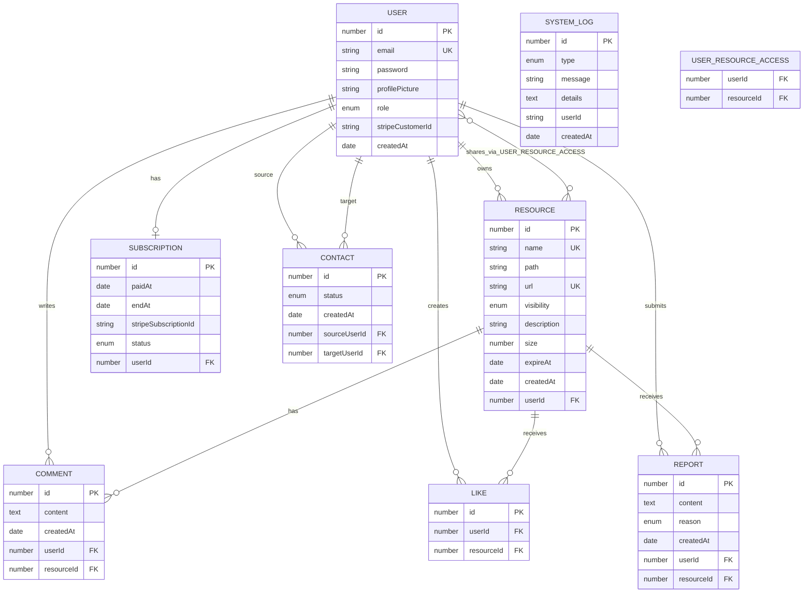
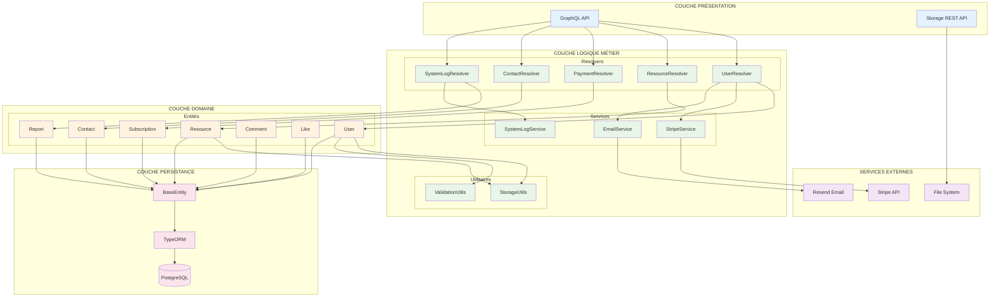

# 📊 DIAGRAMMES UML MERMAID - WILD TRANSFER

Cette documentation contient tous les diagrammes UML convertis en syntaxe Mermaid.js pour utilisation sur mermaidchart.com.

---

## 📋 TABLE DES MATIÈRES

1. [Diagramme de cas d'utilisation](#diagramme-de-cas-dutilisation)
2. [Diagramme de classes complet](#diagramme-de-classes-complet)
3. [Diagramme de classes simplifié](#diagramme-de-classes-simplifié)
4. [Diagramme des relations](#diagramme-des-relations)
5. [Instructions d'utilisation](#instructions-dutilisation)

---

## 🎭 DIAGRAMME DE CAS D'UTILISATION

### Diagramme principal des acteurs et cas d'utilisation

```mermaid
graph TB
    %% Acteurs
    subgraph "ACTEURS HUMAINS"
        V[👤 Visiteur]
        U[🔐 Utilisateur]
        P[💎 Premium] 
        A[👮 Admin]
        E[🔗 Externe]
    end
    
    subgraph "SYSTÈMES"
        S[💳 Stripe]
        M[📧 Email]
        C[🤖 Cleanup]
    end
    
    %% Cas d'utilisation - Authentification
    subgraph "AUTHENTIFICATION"
        UC1[S'inscrire]
        UC2[Se connecter]
        UC3[Se déconnecter]
        UC4[Réinitialiser MDP]
        UC5[Confirmer email]
    end
    
    %% Cas d'utilisation - Gestion Fichiers
    subgraph "GESTION FICHIERS"
        UC6[Upload temporaire]
        UC7[Upload permanent]
        UC8[Télécharger fichier]
        UC9[Supprimer fichier]
        UC10[Consulter fichiers]
    end
    
    %% Cas d'utilisation - Partage
    subgraph "PARTAGE"
        UC11[Partager fichier]
        UC12[Générer lien temp]
        UC13[Accéder lien temp]
        UC14[Gérer permissions]
    end
    
    %% Cas d'utilisation - Social
    subgraph "SYSTÈME SOCIAL"
        UC15[Liker fichier]
        UC16[Commenter]
        UC17[Signaler contenu]
    end
    
    %% Cas d'utilisation - Contacts
    subgraph "CONTACTS"
        UC18[Envoyer demande contact]
        UC19[Accepter contact]
        UC20[Refuser contact]
        UC21[Consulter contacts]
    end
    
    %% Cas d'utilisation - Abonnements
    subgraph "ABONNEMENTS"
        UC22[Souscrire premium]
        UC23[Gérer abonnement]
        UC24[Annuler abonnement]
    end
    
    %% Cas d'utilisation - Administration
    subgraph "ADMINISTRATION"
        UC25[Gérer utilisateurs]
        UC26[Consulter logs]
        UC27[Modérer contenu]
        UC28[Gérer signalements]
    end
    
    %% Relations héritages acteurs
    V --> U
    U --> P
    U --> A
    
    %% Relations Visiteur
    V --> UC1
    V --> UC2
    V --> UC4
    V --> UC6
    V --> UC13
    
    %% Relations Utilisateur (+ hérite Visiteur)
    U --> UC3
    U --> UC5
    U --> UC7
    U --> UC8
    U --> UC9
    U --> UC10
    U --> UC11
    U --> UC12
    U --> UC14
    U --> UC15
    U --> UC16
    U --> UC17
    U --> UC18
    U --> UC19
    U --> UC20
    U --> UC21
    U --> UC22
    
    %% Relations Premium (+ hérite Utilisateur)
    P --> UC23
    P --> UC24
    
    %% Relations Admin (+ hérite Utilisateur)
    A --> UC25
    A --> UC26
    A --> UC27
    A --> UC28
    
    %% Relations Externe
    E --> UC13
    E --> UC8
    
    %% Relations systèmes
    UC1 --> M
    UC4 --> M
    UC5 --> M
    UC22 --> S
    UC23 --> S
    UC24 --> S
    UC6 --> C
    UC12 --> C
    
    %% Styling
    classDef actor fill:#e1f5fe
    classDef system fill:#f3e5f5
    classDef usecase fill:#e8f5e8
    classDef auth fill:#fff3e0
    classDef files fill:#e0f2f1
    classDef social fill:#fce4ec
    classDef admin fill:#ffebee
    
    class V,U,P,A,E actor
    class S,M,C system
    class UC1,UC2,UC3,UC4,UC5 auth
    class UC6,UC7,UC8,UC9,UC10 files
    class UC15,UC16,UC17 social
    class UC25,UC26,UC27,UC28 admin
```



---

## 🏗️ DIAGRAMME DE CLASSES COMPLET

### Diagramme principal avec toutes les entités et relations

```mermaid
classDiagram
    %% Classes abstraites
    class BaseEntity {
        <<abstract>>
        +save() Promise~this~
        +remove() Promise~this~
        +reload() Promise~this~
    }
    
    %% Énumérations
    class UserRole {
        <<enumeration>>
        USER
        ADMIN
    }
    
    class FileVisibility {
        <<enumeration>>
        PRIVATE
        PUBLIC
    }
    
    class SubscriptionStatus {
        <<enumeration>>
        ACTIVE
        CANCELLED
        PAST_DUE
        UNPAID
    }
    
    class ContactStatus {
        <<enumeration>>
        PENDING
        ACCEPTED
        REFUSED
    }
    
    class Reason {
        <<enumeration>>
        CORRUPTED
        DISPLAY
        INAPPROPRIATE
        HARASSMENT
        SPAM
        OTHER
        NONE
    }
    
    class LogType {
        <<enumeration>>
        SUCCESS
        ERROR
        WARNING
        INFO
    }
    
    %% Entité User
    class User {
        -id: number
        -email: string
        -password: string
        -profilePicture: string?
        -lastLoggedAt: Date
        -role: UserRole
        -stripeCustomerId: string?
        -createdAt: Date
        +hashPassword(password: string) Promise~string~
        +verifyPassword(inputPassword: string) Promise~boolean~
        +generateJWT() string
        +generateVerificationCode() string
        +calculateTotalStorageUsed() Promise~number~
        +canUploadFile(fileSize: number) boolean
        +getStorageInfo() UserStorage
        +hasUnlimitedStorage() boolean
        +getSharedResources() Promise~Resource[]~
        +getOwnedResources() Promise~Resource[]~
        +updateProfilePicture(url: string) Promise~void~
        +updateRole(newRole: UserRole) Promise~void~
        +canModifyUser(targetUser: User) boolean
        +isPasswordValid(password: string) boolean
    }
    
    %% Entité Resource
    class Resource {
        -id: number
        -name: string
        -path: string
        -url: string
        -visibility: FileVisibility
        -description: string?
        -size: number
        -expireAt: Date?
        -createdAt: Date
        +formattedSize: string
        +isAccessibleBy(user: User) boolean
        +grantAccessTo(user: User) Promise~void~
        +revokeAccessFrom(user: User) Promise~void~
        +isOwner(user: User) boolean
        +getLikesCount() Promise~number~
        +getCommentsCount() Promise~number~
        +getReportsCount() Promise~number~
        +getTotalSizeByUserId(userId: number)$ Promise~number~
        +findByUserId(userId: number)$ Promise~Resource[]~
        +findSharedWithUser(userId: number)$ Promise~Resource[]~
        +validateStorageLimit(userId: number, fileSize: number)$ Promise~boolean~
    }
    
    %% Entité Subscription
    class Subscription {
        -id: number
        -paidAt: Date
        -endAt: Date
        -stripeSubscriptionId: string?
        -stripePriceId: string?
        -status: SubscriptionStatus
        +calculateEndDate(paidAt: Date) Date
        +isActive() boolean
        +isExpired() boolean
        +renew() Promise~void~
        +cancel() Promise~void~
        +getDaysRemaining() number
    }
    
    %% Entité Contact
    class Contact {
        -id: number
        -status: ContactStatus
        -createdAt: Date
        +acceptRequest() Promise~void~
        +refuseRequest() Promise~void~
        +isRequestValid(sourceUser: User, targetUser: User) boolean
        +sendContactRequest(sourceUser: User, targetUserEmail: string)$ Promise~Contact~
        +getContactsByUser(userId: number)$ Promise~ContactsResponse~
        +getAcceptedContacts(userId: number)$ Promise~Contact[]~
        +getPendingRequests(userId: number)$ Promise~Contact[]~
    }
    
    %% Entité Comment
    class Comment {
        -id: number
        -content: string
        -createdAt: Date
        +isAuthor(user: User) boolean
        +canBeModifiedBy(user: User) boolean
        +findByResource(resourceId: number)$ Promise~Comment[]~
        +findByUser(userId: number)$ Promise~Comment[]~
    }
    
    %% Entité Like
    class Like {
        -id: number
        +toggleLike(user: User, resource: Resource)$ Promise~boolean~
        +isLikedBy(user: User, resource: Resource)$ Promise~boolean~
        +findByResource(resourceId: number)$ Promise~Like[]~
        +findByUser(userId: number)$ Promise~Like[]~
    }
    
    %% Entité Report
    class Report {
        -id: number
        -content: string?
        -reason: Reason
        -createdAt: Date
        +getReasonTranslation() string
        +isReporter(user: User) boolean
        +canBeDeletedBy(user: User) boolean
        +findByResource(resourceId: number)$ Promise~Report[]~
        +getAllReports()$ Promise~Report[]~
    }
    
    %% Entité SystemLog
    class SystemLog {
        -id: number
        -type: LogType
        -message: string
        -details: string?
        -userId: string?
        -createdAt: Date
    }
    
    %% Entité TempUser
    class TempUser {
        -id: number
        -email: string
        -password: string
        -randomCode: string
    }
    
    %% Classe UserStorage
    class UserStorage {
        +bytesUsed: string
        +percentage: number
    }
    
    %% Services
    class StripeService {
        <<service>>
        +createPaymentIntent(options: CreatePaymentIntentOptions)$ Promise~PaymentIntentResult~
        +confirmPayment(options: ConfirmPaymentOptions)$ Promise~PaymentIntent~
        +getOrCreateCustomer(user: User)$ Promise~string~
        +createSubscription(user: User, priceId: string)$ Promise~Subscription~
        +cancelSubscription(subscriptionId: string)$ Promise~Subscription~
        +getPaymentIntent(paymentIntentId: string)$ Promise~PaymentIntent~
        +handleWebhook(event: Event)$ Promise~void~
        +handlePaymentSucceeded(paymentIntent: PaymentIntent)$ Promise~void~
        +handlePaymentFailed(paymentIntent: PaymentIntent)$ Promise~void~
    }
    
    class EmailService {
        <<service>>
        +sendVerificationEmail(email: string, code: string, lang: string)$ Promise~void~
        +sendResetPasswordEmail(email: string, resetLink: string, lang: string)$ Promise~void~
        +sendWelcomeEmail(user: User)$ Promise~void~
    }
    
    class SystemLogService {
        <<service>>
        +logEvent(type: LogType, message: string, details?: string, userId?: string)$ Promise~SystemLog~
        +getLogsByType(type: LogType)$ Promise~SystemLog[]~
        +cleanOldLogs(daysToKeep: number)$ Promise~void~
        +exportLogs(startDate: Date, endDate: Date)$ Promise~string~
    }
    
    %% Utilitaires
    class StorageUtils {
        <<utility>>
        +formatFileSize(bytes: number)$ string
        +calculateStoragePercentage(bytesUsed: number)$ number
        +isStorageLimitExceeded(currentSize: number, newFileSize: number, hasSubscription: boolean)$ boolean
        +getMaxStorageForUser(hasSubscription: boolean)$ number
    }
    
    class ValidationUtils {
        <<utility>>
        +validateEmail(email: string)$ boolean
        +validatePassword(password: string)$ boolean
        +validateFileSize(size: number)$ boolean
        +validateFileName(name: string)$ boolean
    }
    
    %% Relations d'héritage
    BaseEntity <|-- User
    BaseEntity <|-- Resource
    BaseEntity <|-- Subscription
    BaseEntity <|-- Contact
    BaseEntity <|-- Comment
    BaseEntity <|-- Like
    BaseEntity <|-- Report
    BaseEntity <|-- SystemLog
    BaseEntity <|-- TempUser
    
    %% Relations avec énumérations
    User ||--|| UserRole : has
    Resource ||--|| FileVisibility : has
    Subscription ||--|| SubscriptionStatus : has
    Contact ||--|| ContactStatus : has
    Report ||--|| Reason : has
    SystemLog ||--|| LogType : has
    
    %% Relations principales
    User ||--o{ Resource : owns
    User ||--o| Subscription : has
    User }o--o{ Resource : shares
    User ||--o{ Contact : sourceUser
    User ||--o{ Contact : targetUser
    User ||--o{ Comment : writes
    User ||--o{ Like : creates
    User ||--o{ Report : submits
    
    Resource ||--o{ Comment : has
    Resource ||--o{ Like : receives
    Resource ||--o{ Report : receives
    
    %% Relation User-UserStorage
    User ||--|| UserStorage : calculates
    
    %% Relations avec services (utilisations)
    User ..> StripeService : uses
    User ..> EmailService : uses
    SystemLog ..> SystemLogService : managed_by
    Resource ..> StorageUtils : uses
    User ..> ValidationUtils : uses
```

---

## 🎯 DIAGRAMME DE CLASSES SIMPLIFIÉ (Vue d'ensemble)

### Version allégée pour une meilleure lisibilité

```mermaid
classDiagram
    class BaseEntity {
        <<abstract>>
        +save()
        +remove()
        +reload()
    }
    
    class User {
        -id: number
        -email: string
        -role: UserRole
        -stripeCustomerId: string
        +hashPassword()
        +generateJWT()
        +canUploadFile()
        +hasUnlimitedStorage()
    }
    
    class Resource {
        -id: number
        -name: string
        -size: number
        -visibility: FileVisibility
        +isAccessibleBy(user)
        +grantAccessTo(user)
        +getLikesCount()
    }
    
    class Subscription {
        -id: number
        -status: SubscriptionStatus
        -endAt: Date
        +isActive()
        +cancel()
    }
    
    class Contact {
        -status: ContactStatus
        +acceptRequest()
        +refuseRequest()
    }
    
    class Comment {
        -content: string
        +isAuthor(user)
    }
    
    class Like {
        +toggleLike()$
    }
    
    class Report {
        -reason: Reason
        +getReasonTranslation()
    }
    
    class StripeService {
        <<service>>
        +createPaymentIntent()$
        +createSubscription()$
        +handleWebhook()$
    }
    
    class EmailService {
        <<service>>
        +sendVerificationEmail()$
        +sendWelcomeEmail()$
    }
    
    %% Héritage
    BaseEntity <|-- User
    BaseEntity <|-- Resource
    BaseEntity <|-- Subscription
    BaseEntity <|-- Contact
    BaseEntity <|-- Comment
    BaseEntity <|-- Like
    BaseEntity <|-- Report
    
    %% Relations principales
    User ||--o{ Resource : owns
    User ||--o| Subscription : has
    User }o--o{ Resource : shares
    User ||--o{ Contact : creates
    User ||--o{ Comment : writes
    User ||--o{ Like : creates
    User ||--o{ Report : submits
    
    Resource ||--o{ Comment : has
    Resource ||--o{ Like : receives
    Resource ||--o{ Report : receives
    
    Contact }o--|| User : sourceUser
    Contact }o--|| User : targetUser
    
    %% Utilisation des services
    User ..> StripeService : uses
    User ..> EmailService : uses
```

---

## 🔗 DIAGRAMME DES RELATIONS (Entity Relationship)

### Focus sur les relations entre entités



---

## 📊 DIAGRAMME D'ARCHITECTURE (Composants)

### Vue d'ensemble de l'architecture système



---

## 🎯 INSTRUCTIONS D'UTILISATION

### Comment utiliser ces diagrammes sur mermaidchart.com

1. **Accédez à mermaidchart.com**
2. **Créez un nouveau diagramme**
3. **Copiez-collez le code Mermaid souhaité**
4. **Le diagramme se génère automatiquement**

### Recommandations par diagramme :

#### 📋 **Diagramme de cas d'utilisation**
- **Usage** : Présentation aux parties prenantes
- **Complexité** : Élevée (beaucoup d'éléments)
- **Conseil** : Utilisez le mode plein écran

#### 🏗️ **Diagramme de classes complet** 
- **Usage** : Documentation technique détaillée
- **Complexité** : Très élevée
- **Conseil** : Exportez en SVG haute résolution

#### 🎯 **Diagramme de classes simplifié**
- **Usage** : Vue d'ensemble rapide
- **Complexité** : Modérée
- **Conseil** : Idéal pour les présentations

#### 🔗 **Diagramme des relations**
- **Usage** : Design de base de données
- **Complexité** : Modérée
- **Conseil** : Utilisez pour la documentation DB

#### 📊 **Diagramme d'architecture**
- **Usage** : Vue technique de l'architecture
- **Complexité** : Faible
- **Conseil** : Parfait pour les équipes de développement

### Options d'export recommandées :
- **SVG** : Pour impression haute qualité
- **PNG** : Pour intégration dans documents
- **PDF** : Pour partage professionnel

### Personnalisation :
Tous les diagrammes incluent des classes CSS pour personnaliser les couleurs :
- Modifiez les `classDef` pour changer les thèmes
- Ajustez les couleurs selon votre charte graphique
- Les couleurs actuelles sont optimisées pour la lisibilité

---

**Créé le** : 28 août 2025  
**Version** : 1.0 - Diagrammes Mermaid complets  
**Compatible** : mermaidchart.com, GitHub, GitLab, Notion