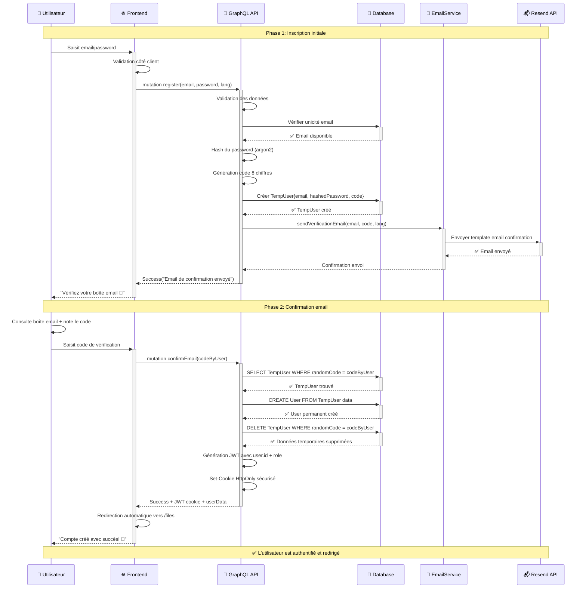
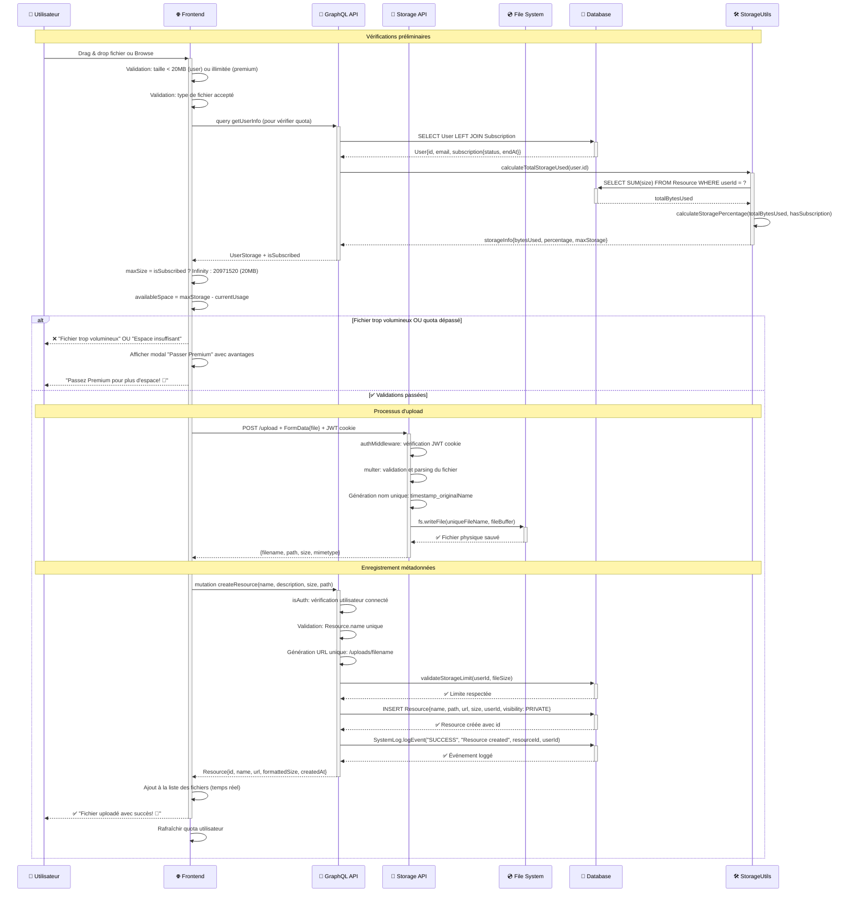
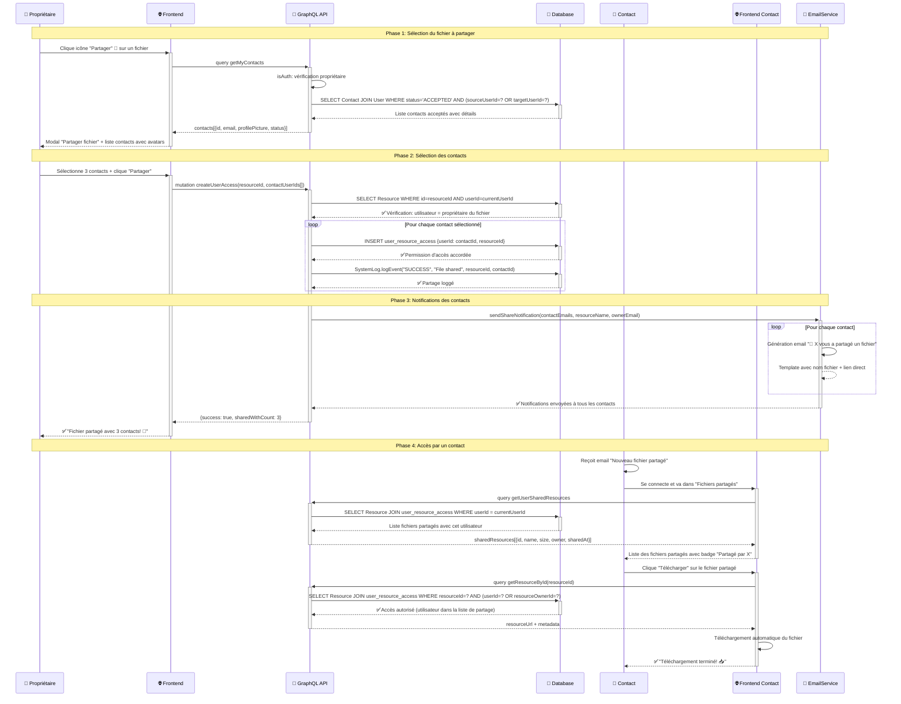
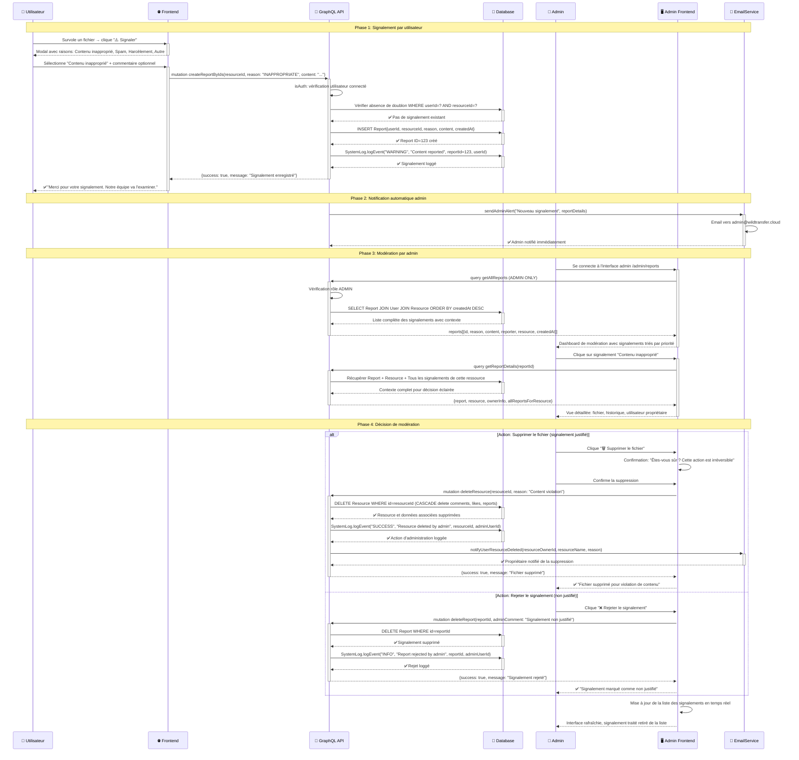
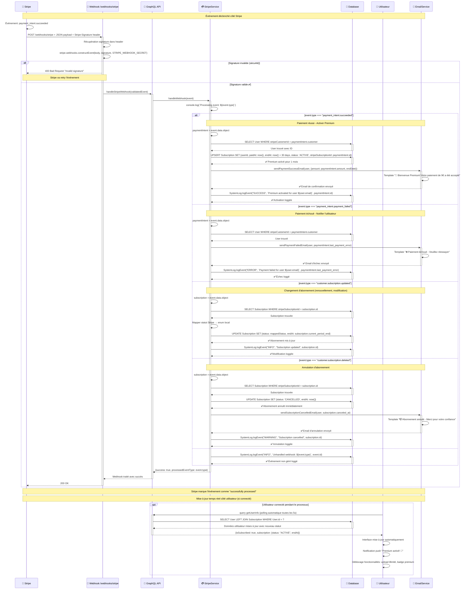

# 🔄 DIAGRAMMES DE SÉQUENCE MERMAID - COPIER-COLLER

Diagrammes de séquence optimisés pour utilisation directe sur mermaidchart.com.

---

## 1️⃣ INSCRIPTION ET AUTHENTIFICATION COMPLÈTE



---

## 2️⃣ UPLOAD FICHIER AVEC VÉRIFICATIONS QUOTA



---

## 3️⃣ PAIEMENT STRIPE PREMIUM COMPLET

```mermaid
sequenceDiagram
    participant U as 👤 Utilisateur
    participant F as 🌐 Frontend
    participant G as 📡 GraphQL API
    participant SS as 💳 StripeService
    participant ST as 🏦 Stripe API
    participant DB as 💾 Database
    participant W as 🔔 Webhook
    
    Note over U,W: Phase 1: Création PaymentIntent
    U->>+F: Clique "Devenir Premium - 9€/mois"
    F->>F: Affichage loader "Préparation du paiement..."
    
    F->>+G: mutation createPaymentIntent(amount: 900, currency: "eur", description: "Abonnement Premium")
    G->>G: isAuth: vérification JWT cookie
    G->>+SS: createPaymentIntent({amount: 900, currency: "eur", description})
    
    SS->>+DB: getOrCreateStripeCustomer(user)
    alt stripeCustomerId existe déjà
        DB-->>SS: stripeCustomerId from User table
    else Premier paiement utilisateur
        SS->>+ST: POST /v1/customers {email: user.email, name: user.email}
        ST-->>-SS: Customer{id: "cus_xxxxx"}
        SS->>+DB: UPDATE User SET stripeCustomerId = "cus_xxxxx"
        DB-->>-SS: ✅ Customer ID sauvé
    end
    
    SS->>+ST: POST /v1/payment_intents {amount: 900, currency: "eur", customer: customerId}
    ST-->>-SS: PaymentIntent{id, client_secret, status: "requires_payment_method"}
    SS-->>-G: {clientSecret, paymentIntentId}
    
    G-->>-F: clientSecret pour Stripe Elements
    F->>F: Initialisation Stripe Elements avec clientSecret
    F-->>-U: Formulaire de paiement sécurisé
    
    Note over U,W: Phase 2: Saisie et confirmation paiement
    U->>F: Saisit numéro carte, CVC, date expiration
    F->>F: Validation temps réel Stripe Elements
    U->>+F: Clique "Payer 9,00 €"
    F->>F: Affichage loader "Traitement du paiement..."
    
    F->>+ST: stripe.confirmPayment(clientSecret, {payment_method: {card: elements}})
    ST->>ST: Vérification carte + autorisation bancaire
    
    alt Paiement refusé
        ST-->>F: PaymentIntent{status: "requires_payment_method", error}
        F-->>U: ❌ "Paiement refusé: " + error.message
        F-->>U: "Vérifiez vos informations bancaires"
    else Paiement accepté
        ST-->>-F: PaymentIntent{status: "succeeded"}
        F-->>-U: ✅ "Paiement accepté! Activation en cours... ⏳"
    end
    
    Note over U,W: Phase 3: Webhook traitement asynchrone
    ST->>+W: POST /webhooks/stripe + Event{type: "payment_intent.succeeded"}
    W->>W: Vérification signature Stripe (sécurité)
    
    W->>+G: handleStripeWebhook(event)
    G->>+SS: handleWebhook(event)
    SS->>SS: switch(event.type)
    
    alt payment_intent.succeeded
        SS->>+DB: SELECT User WHERE stripeCustomerId = paymentIntent.customer
        DB-->>-SS: User trouvé
        
        SS->>+DB: INSERT/UPDATE Subscription {userId, paidAt: now(), endAt: now() + 30 days, status: ACTIVE, stripePaymentIntentId}
        DB-->>-SS: ✅ Abonnement Premium activé
        
        SS->>+DB: SystemLog.logEvent("SUCCESS", "Premium subscription activated", userId)
        DB-->>-SS: ✅ Activation loggée
        
    else payment_intent.payment_failed
        SS->>+DB: SystemLog.logEvent("ERROR", "Payment failed", paymentIntent.customer)
        DB-->>-SS: ✅ Échec loggé
    end
    
    SS-->>-G: Webhook traité avec succès
    G-->>-W: 200 OK
    W-->>-ST: ✅ Webhook acknowledgment
    
    Note over U,W: Phase 4: Mise à jour interface utilisateur
    F->>F: Polling getUserInfo toutes les 2 secondes
    F->>+G: query getUserInfo
    G->>+DB: SELECT User LEFT JOIN Subscription WHERE User.id = userId
    DB-->>-G: User{subscription{status: ACTIVE, endAt}}
    G-->>-F: isSubscribed: true, subscriptionEndDate
    
    F->>F: Mise à jour UI: badge "Premium", fonctionnalités débloquées
    F-->>-U: 🎉 "Bienvenue dans Wild Transfer Premium!"
    F-->>U: "✨ Upload illimité débloqué ✨"
```

---

## 4️⃣ PARTAGE DE FICHIER AVEC CONTACTS



---

## 5️⃣ GÉNÉRATION LIEN TEMPORAIRE PUBLIC

```mermaid
sequenceDiagram
    participant U as 👤 Utilisateur
    participant F as 🌐 Frontend
    participant S as 📁 Storage API
    participant FS as 💿 File System
    participant DB as 💾 JSON File
    participant EXT as 🌍 Utilisateur Externe
    participant C as 🤖 CleanupService
    
    Note over U,C: Phase 1: Upload pour partage temporaire
    U->>+F: Page "Partage rapide" + sélection fichier
    F->>F: Validation: fichier < 100MB pour partage temporaire
    F-->>U: "Génération du lien de partage... ⏳"
    
    F->>+S: POST /temp/upload + FormData{file}
    S->>S: Génération tempId unique (UUID v4)
    S->>S: Calcul expiration = now() + 24 heures
    S->>S: fileName = tempId + originalExtension
    
    S->>+FS: Sauvegarde dans /temp/{tempId}.ext
    FS-->>-S: ✅ Fichier temporaire sauvé
    
    S->>+DB: JSON.save({tempId, originalName, size, expiresAt, createdAt})
    DB-->>-S: ✅ Métadonnées temporaires sauvées
    
    S-->>-F: {tempId, shareUrl: `/temp/${tempId}`, expiresAt}
    
    F->>F: Génération QR Code pour l'URL
    F-->>-U: 🔗 Lien + QR Code + "Expire dans 24h"
    U-->>U: Copie lien et partage (email, SMS, etc.)
    
    Note over U,C: Phase 2: Accès par utilisateur externe
    EXT->>EXT: Reçoit le lien https://domain.com/temp/abc-123-def
    EXT->>+S: GET /temp/{tempId}
    S->>+DB: JSON.find(tempId)
    
    alt Fichier expiré ou inexistant
        DB-->>S: null OU expiresAt < now()
        S-->>EXT: 404 ❌ "Fichier expiré ou non trouvé"
        S-->>EXT: "Les liens temporaires expirent après 24h"
    else Fichier valide et accessible
        DB-->>-S: {originalName, size, expiresAt}
        S->>+FS: fs.readFile(/temp/{tempId})
        FS-->>-S: fileBuffer
        
        S->>S: Content-Disposition: attachment; filename="originalName"
        S->>S: Content-Type: application/octet-stream
        S-->>-EXT: ✅ Téléchargement direct du fichier
    end
    
    EXT-->>EXT: Fichier téléchargé avec nom original
    
    Note over U,C: Phase 3: Nettoyage automatique (CRON)
    C->>C: Tâche CRON toutes les heures
    C->>+DB: JSON.filter(file => file.expiresAt < now())
    DB-->>-C: Liste des fichiers expirés
    
    loop Pour chaque fichier expiré
        C->>+FS: fs.unlink(/temp/{tempId})
        FS-->>-C: ✅ Fichier physique supprimé
        
        C->>+DB: JSON.remove(tempId)
        DB-->>-C: ✅ Métadonnées supprimées
    end
    
    C->>C: console.log(`🗑️ Cleanup: ${count} fichiers supprimés`)
    
    Note over U,C: ✅ Système auto-nettoyant pour économiser l'espace disque
```

---

## 6️⃣ WORKFLOW SIGNALEMENT ET MODÉRATION



---

## 7️⃣ SYSTÈME WEBHOOK STRIPE COMPLET



---

## 📋 GUIDE D'UTILISATION

### 🚀 Pour utiliser sur mermaidchart.com :

1. **Copiez** un diagramme complet ci-dessus
2. **Allez** sur https://mermaidchart.com  
3. **Collez** le code dans l'éditeur
4. **Ajustez** si besoin la taille d'affichage
5. **Exportez** en PNG/SVG/PDF

### 💡 Conseils par diagramme :

| Diagramme | Complexité | Durée réelle | Usage recommandé |
|-----------|------------|--------------|------------------|
| **Inscription** | ⭐⭐⭐ | ~30 secondes | Documentation onboarding |
| **Upload fichier** | ⭐⭐⭐⭐ | ~5-30 secondes | Documentation technique |
| **Paiement Stripe** | ⭐⭐⭐⭐⭐ | ~2-5 minutes | Intégration paiement |
| **Partage fichier** | ⭐⭐⭐ | ~10 secondes | Fonctionnalités sociales |
| **Lien temporaire** | ⭐⭐ | ~5 secondes | Partage rapide |
| **Signalement** | ⭐⭐⭐⭐ | ~1-24h | Processus modération |
| **Webhook Stripe** | ⭐⭐⭐⭐ | ~1-5 secondes | Architecture backend |

### 🎨 Personnalisation :

- **Couleurs** : Modifiez les emojis et participants
- **Détails** : Ajoutez/retirez des étapes selon vos besoins
- **Messages** : Adaptez les textes à votre contexte

---

**🎯 Prêt pour mermaidchart.com - Copier/Coller direct !**