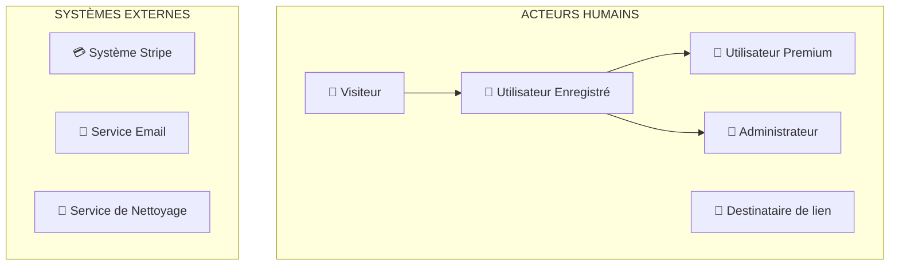

# 📊 DOCUMENTATION UML - WILD TRANSFER

Cette documentation présente l'analyse UML complète du projet Wild Transfer, une application de partage de fichiers développée avec une architecture microservices.

---

## 📑 TABLE DES MATIÈRES

1. [Vue d'ensemble du système](#vue-densemble-du-système)
2. [Diagramme de cas d'utilisation](#diagramme-de-cas-dutilisation)
3. [Analyse des acteurs](#analyse-des-acteurs)
4. [Cas d'utilisation détaillés](#cas-dutilisation-détaillés)
5. [Relations et contraintes](#relations-et-contraintes)
6. [Diagramme de classes UML](#diagramme-de-classes-uml)
7. [Patrons de conception](#patrons-de-conception)
8. [Recommandations de sécurité](#recommandations-de-sécurité)
9. [Architecture technique](#architecture-technique)

---

## 🎯 VUE D'ENSEMBLE DU SYSTÈME

Wild Transfer est une plateforme de partage de fichiers moderne construite avec :

- **Frontend** : React 19 + TypeScript + Vite
- **Backend** : Node.js + GraphQL (Apollo Server) + PostgreSQL  
- **Storage API** : Express.js pour la gestion des fichiers
- **E2E Testing** : Playwright
- **Paiements** : Intégration Stripe complète
- **Emails** : Service Resend avec templates React

### Fonctionnalités principales
✅ Partage de fichiers sécurisé  
✅ Système d'abonnement premium  
✅ Gestion des contacts et collaboration  
✅ Système social (likes, commentaires, signalements)  
✅ Interface d'administration complète  
✅ Support multilingue (FR/EN)  

---

## 📋 DIAGRAMME DE CAS D'UTILISATION

### 🎭 Acteurs du système



### 📊 Matrice des cas d'utilisation

| Cas d'utilisation | 👤 Visiteur | 🔐 Utilisateur | 💎 Premium | 👮 Admin | 🔗 Externe |
|-------------------|-------------|----------------|-------------|-----------|------------|
| **GESTION COMPTES** | | | | | |
| S'inscrire | ✅ | ✅ | ✅ | ✅ | ❌ |
| Se connecter | ✅ | ✅ | ✅ | ✅ | ❌ |
| Gérer profil | ❌ | ✅ | ✅ | ✅ | ❌ |
| Réinitialiser MDP | ✅ | ✅ | ✅ | ✅ | ❌ |
| **GESTION FICHIERS** | | | | | |
| Upload temporaire | ✅ | ✅ | ✅ | ✅ | ❌ |
| Upload permanent | ❌ | ✅ | ✅ | ✅ | ❌ |
| Télécharger | ❌ | ✅ | ✅ | ✅ | ✅ |
| Supprimer | ❌ | ✅ | ✅ | ✅ | ❌ |
| **PARTAGE** | | | | | |
| Partager fichier | ❌ | ✅ | ✅ | ✅ | ❌ |
| Générer lien temp | ❌ | ✅ | ✅ | ✅ | ❌ |
| Accéder lien | ✅ | ✅ | ✅ | ✅ | ✅ |
| **SYSTÈME SOCIAL** | | | | | |
| Liker fichier | ❌ | ✅ | ✅ | ✅ | ❌ |
| Commenter | ❌ | ✅ | ✅ | ✅ | ❌ |
| Signaler contenu | ❌ | ✅ | ✅ | ✅ | ❌ |
| **CONTACTS** | | | | | |
| Gérer contacts | ❌ | ✅ | ✅ | ✅ | ❌ |
| Envoyer demande | ❌ | ✅ | ✅ | ✅ | ❌ |
| **ABONNEMENTS** | | | | | |
| Souscrire premium | ❌ | ✅ | ❌ | ✅ | ❌ |
| Gérer abonnement | ❌ | ❌ | ✅ | ✅ | ❌ |
| **ADMINISTRATION** | | | | | |
| Gérer utilisateurs | ❌ | ❌ | ❌ | ✅ | ❌ |
| Consulter logs | ❌ | ❌ | ❌ | ✅ | ❌ |
| Modérer contenu | ❌ | ❌ | ❌ | ✅ | ❌ |

---

## 🔍 ANALYSE DES ACTEURS

### 👤 **Visiteur (Non authentifié)**
**Rôle** : Utilisateur anonyme découvrant la plateforme
**Permissions** :
- ✅ Consulter la page d'accueil et informations publiques
- ✅ S'inscrire et créer un compte
- ✅ Se connecter à un compte existant
- ✅ Uploader des fichiers temporaires (partage rapide)
- ✅ Accéder aux liens temporaires partagés
- ✅ Réinitialiser son mot de passe oublié
- ❌ Accès aux fonctionnalités avancées

**Limitations** : Fonctionnalités de base uniquement, pas de stockage permanent

### 🔐 **Utilisateur Enregistré**
**Rôle** : Utilisateur authentifié avec compte vérifié
**Hérite de** : Toutes les permissions Visiteur
**Permissions supplémentaires** :
- ✅ Upload de fichiers permanents (limite 20MB)
- ✅ Gestion complète de ses fichiers
- ✅ Création et gestion de contacts
- ✅ Partage sécurisé avec ses contacts
- ✅ Participation au système social (likes, commentaires)
- ✅ Signalement de contenu inapproprié
- ✅ Consultation de ses statistiques personnelles
- ✅ Mise à jour de son profil et photo

**Limitations** : Espace de stockage limité, taille de fichier limitée

### 💎 **Utilisateur Premium**
**Rôle** : Utilisateur avec abonnement payant actif
**Hérite de** : Toutes les permissions Utilisateur Enregistré
**Avantages premium** :
- ✅ Upload de fichiers de grande taille (>20MB)
- ✅ Espace de stockage étendu/illimité
- ✅ Fonctionnalités de partage avancées
- ✅ Gestion de son abonnement Stripe
- ✅ Support prioritaire
- ✅ Statistiques détaillées

**Gestion** : Peut annuler ou modifier son abonnement

### 👮 **Administrateur**
**Rôle** : Gestionnaire du système avec tous les privilèges
**Hérite de** : Toutes les permissions des autres utilisateurs
**Pouvoirs administratifs** :
- ✅ Gestion complète des utilisateurs (CRUD)
- ✅ Modification des rôles utilisateur
- ✅ Consultation et gestion de tous les fichiers
- ✅ Accès aux logs système complets
- ✅ Gestion des signalements et modération
- ✅ Consultation des statistiques globales
- ✅ Gestion des abonnements
- ✅ Nettoyage manuel des fichiers expirés
- ✅ Accès aux interfaces d'administration

**Responsabilités** : Maintenance système, modération, support utilisateurs

### 🔗 **Destinataire de lien temporaire**
**Rôle** : Personne externe accédant via un lien partagé
**Permissions spécifiques** :
- ✅ Accès au fichier spécifique via lien temporaire
- ✅ Téléchargement du fichier partagé
- ✅ Consultation des informations du fichier
- ❌ Aucune autre interaction avec le système

**Contraintes** : Accès limité dans le temps, fichier spécifique uniquement

---

## 📋 CAS D'UTILISATION DÉTAILLÉS

### 🏠 **UC-001 : S'inscrire**
**Acteur principal** : Visiteur
**Préconditions** : Aucune
**Scénario principal** :
1. L'utilisateur accède à la page d'inscription
2. Il saisit email, mot de passe et confirme
3. Le système valide les données (unicité email, force MDP)
4. Un code de confirmation à 8 chiffres est envoyé par email
5. L'utilisateur confirme avec le code reçu
6. Le compte est activé

**Postconditions** : Compte créé et activé
**Extensions** :
- Email déjà existant → Message d'erreur
- Mot de passe faible → Demande de renforcement
- Code invalide → Possibilité de renvoyer

### 🔐 **UC-002 : Se connecter**
**Acteur principal** : Visiteur, Utilisateur
**Préconditions** : Compte existant et activé
**Scénario principal** :
1. Saisie email/mot de passe
2. Validation des identifiants
3. Génération du JWT sécurisé
4. Redirection vers le dashboard

**Postconditions** : Session utilisateur active
**Extensions** :
- Identifiants incorrects → Message d'erreur
- Compte non confirmé → Redirection confirmation

### 📁 **UC-003 : Uploader un fichier permanent**
**Acteur principal** : Utilisateur Enregistré, Premium, Admin
**Préconditions** : Authentifié
**Scénario principal** :
1. Sélection du fichier local
2. Vérification de la taille (limite selon type utilisateur)
3. Vérification de l'espace disponible
4. Upload sécurisé vers storage-api
5. Création de l'enregistrement en base
6. Génération de l'URL d'accès

**Postconditions** : Fichier stocké et accessible
**Extensions** :
- Fichier trop volumineux → Message limite
- Espace insuffisant → Proposition upgrade premium
- Erreur upload → Retry ou message d'erreur

### 🤝 **UC-004 : Partager un fichier**
**Acteur principal** : Utilisateur Enregistré, Premium, Admin
**Préconditions** : Fichier existant, contacts disponibles
**Scénario principal** :
1. Sélection du fichier à partager
2. Choix du mode de partage :
   - Avec contacts spécifiques
   - Via lien temporaire public
3. Configuration des permissions et durée
4. Envoi des notifications
5. Création des accès en base

**Postconditions** : Fichier accessible aux destinataires
**Inclut** : Génération lien temporaire (si choisi)

### 💳 **UC-005 : Souscrire à un abonnement premium**
**Acteur principal** : Utilisateur Enregistré
**Préconditions** : Authentifié, pas déjà premium
**Scénario principal** :
1. Consultation des offres premium
2. Sélection de l'abonnement désiré
3. Redirection vers Stripe Payment
4. Saisie des informations de paiement
5. Traitement du paiement par Stripe
6. Webhook de confirmation reçu
7. Mise à jour du statut utilisateur
8. Activation des fonctionnalités premium

**Postconditions** : Utilisateur premium actif
**Acteurs secondaires** : Système Stripe
**Extensions** :
- Paiement refusé → Message d'erreur et retry
- Problème technique → Rollback et support

### 👮 **UC-006 : Gérer les utilisateurs (Admin)**
**Acteur principal** : Administrateur
**Préconditions** : Authentifié comme admin
**Scénario principal** :
1. Accès à l'interface d'administration
2. Consultation de la liste des utilisateurs
3. Actions possibles :
   - Visualiser les détails
   - Modifier le rôle (USER/ADMIN)
   - Supprimer un compte
   - Consulter les statistiques
4. Confirmation des actions sensibles
5. Logging automatique des modifications

**Postconditions** : Modifications appliquées et loggées
**Extensions** :
- Tentative suppression admin → Confirmation renforcée
- Erreur système → Rollback et log d'erreur

---

## 🔗 RELATIONS ET CONTRAINTES

### Relations d'héritage
```
👤 Visiteur
    ↓ (hérite + authentification)
🔐 Utilisateur Enregistré
    ↓ (hérite + abonnement)        ↓ (hérite + privilèges admin)
💎 Utilisateur Premium           👮 Administrateur
```

### Relations d'inclusion et d'extension

**INCLUSIONS (obligatoires)** :
- `S'inscrire` **INCLUT** `Envoyer email de confirmation`
- `Uploader fichier permanent` **INCLUT** `Vérifier espace disponible`
- `Souscrire premium` **INCLUT** `Traiter paiement Stripe`
- `Gérer utilisateurs` **INCLUT** `Logger les actions`

**EXTENSIONS (optionnelles)** :
- `Partager fichier` **ÉTEND** `Générer lien temporaire`
- `Upload échoué` **ÉTEND** `Proposer upgrade premium`
- `Espace insuffisant` **ÉTEND** `Souscrire premium`

### Contraintes métier

**Contraintes de sécurité** :
- Seul le propriétaire peut modifier/supprimer ses fichiers
- Les administrateurs peuvent tout voir mais actions loggées
- Les liens temporaires expirent automatiquement
- L'authentification est requise pour les actions sensibles

**Contraintes techniques** :
- Limite de 20MB pour utilisateurs standards
- Nettoyage automatique des fichiers expirés
- Un utilisateur ne peut avoir qu'un seul abonnement actif
- Les logs système sont conservés pour audit

**Contraintes fonctionnelles** :
- Un utilisateur ne peut pas s'ajouter lui-même en contact
- Les signalements ne peuvent pas être en double
- Les likes sont uniques par utilisateur/ressource
- Les commentaires ont une limite de 500 caractères

---

## ⚠️ RECOMMANDATIONS DE SÉCURITÉ

### 🚨 Vulnérabilités critiques identifiées

#### **1. Actions d'administration non protégées**
```graphql
# PROBLÈME : Accessible à tous
mutation {
  deleteUser(id: "123") 
  updateUserRole(id: "456", role: ADMIN)
}
```

**Solution** : Ajouter `@Authorized('admin')`
```graphql
@Authorized('admin')
@Mutation(() => Boolean)
async deleteUser(@Arg('id') id: string) { }
```

#### **2. Exposition des données sensibles**
```graphql
# PROBLÈME : Liste tous les utilisateurs publiquement
query {
  getAllUsers {
    id email role stripeCustomerId
  }
}
```

**Solution** : Restreindre l'accès ou filtrer les données

#### **3. CRUD des ressources non sécurisé**
Les mutations de fichiers n'ont pas de vérification de propriétaire

**Solution** : Implémenter la vérification dans chaque resolver

#### **4. Système de logs ouvert**
Les logs système sont accessibles à tous les utilisateurs

### ✅ Recommandations d'amélioration

1. **Authentification renforcée** :
   - Ajouter `@UseMiddleware(isAuth)` sur toutes les actions sensibles
   - Implémenter la vérification de propriétaire des ressources
   - Sécuriser l'accès aux logs système avec `@Authorized('admin')`

2. **Validation des données** :
   - Renforcer les validations côté serveur
   - Implémenter la sanitisation des entrées utilisateur
   - Ajouter des limites de rate limiting spécifiques

3. **Audit et monitoring** :
   - Étendre le système de logs pour toutes les actions
   - Implémenter des alertes de sécurité
   - Ajouter le tracking des connexions suspectes

4. **Permissions granulaires** :
   - Créer un système de rôles plus fin
   - Implémenter des permissions par ressource
   - Ajouter la gestion des groupes d'utilisateurs

---

## 🏗️ ARCHITECTURE TECHNIQUE

### Stack technologique
```
┌─────────────────────────────────────────────┐
│                FRONTEND                     │
│   React 19 + TypeScript + Vite             │
│   Apollo Client + Tailwind CSS             │
├─────────────────────────────────────────────┤
│                BACKEND API                  │
│   Node.js + Apollo Server + TypeORM        │
│   PostgreSQL + JWT + GraphQL               │
├─────────────────────────────────────────────┤
│               STORAGE API                   │
│   Express.js + Multer + JWT                │
│   File System + Cleanup Service            │
├─────────────────────────────────────────────┤
│            SERVICES EXTERNES                │
│   Stripe (Paiements) + Resend (Emails)     │
└─────────────────────────────────────────────┘
```

### Flux de données principaux

**1. Authentification** :
```
Frontend → GraphQL API → JWT Generation → Cookie Storage
```

**2. Upload de fichier** :
```
Frontend → Storage API → File System → GraphQL API → Database
```

**3. Paiement** :
```
Frontend → Stripe → Webhook → GraphQL API → User Update
```

### Ports et services
- **Frontend** : Port 5173 (dev) / 80 (prod via nginx)
- **Backend GraphQL** : Port 4000
- **Storage API** : Port 3000
- **PostgreSQL** : Port 5432
- **Adminer** : Port 8080
- **Docker Stack** : Port 7007 (nginx reverse proxy)

---

## 📊 MÉTRIQUES ET STATISTIQUES

### Analyse quantitative du système
- **Nombre d'acteurs** : 6 (4 humains + 2 externes)
- **Cas d'utilisation principaux** : 35+
- **Domaines fonctionnels** : 7
- **Entités de base de données** : 9
- **Relations d'héritage** : 3 niveaux
- **Intégrations externes** : 2 (Stripe, Resend)

### Répartition des fonctionnalités par acteur
- **Visiteur** : 6 cas d'utilisation (17%)
- **Utilisateur** : 22 cas d'utilisation (63%)
- **Premium** : 25 cas d'utilisation (71%)  
- **Admin** : 35+ cas d'utilisation (100%)

---

## 🎯 CONCLUSION

Wild Transfer présente une architecture solide et moderne avec une séparation claire des responsabilités. Le système offre une gamme complète de fonctionnalités pour le partage de fichiers, la collaboration et la monétisation.

### Points forts identifiés
✅ Architecture microservices bien structurée  
✅ Système d'authentification robuste avec JWT  
✅ Intégration paiement complète avec Stripe  
✅ Interface d'administration complète  
✅ Système social engageant  
✅ Support multilingue  
✅ Tests E2E avec Playwright  

### Axes d'amélioration prioritaires
🔧 Sécurisation des endpoints administrateurs  
🔧 Implémentation de permissions granulaires  
🔧 Renforcement du système d'audit  
🔧 Optimisation des performances  

---

## 🏗️ DIAGRAMME DE CLASSES UML

### 📊 Vue d'ensemble des classes

Le système Wild Transfer est organisé autour de 9 entités principales héritant de `BaseEntity`, 3 services de logique métier, et plusieurs classes utilitaires. Voici l'organisation complète :

### 🏛️ **Classes Entités (Domaine)**

#### **User** - Entité centrale du système
```
┌─────────────────────────────────────────────────────────────┐
│                          User                               │
├─────────────────────────────────────────────────────────────┤
│ - id: number                                                │
│ - email: string {unique}                                    │
│ - password: string                                          │
│ - profilePicture: string?                                   │
│ - role: UserRole = USER                                     │
│ - stripeCustomerId: string?                                 │
│ - createdAt: Date                                          │
├─────────────────────────────────────────────────────────────┤
│ + hashPassword(password: string): Promise<string>           │
│ + verifyPassword(inputPassword: string): Promise<boolean>   │
│ + generateJWT(): string                                     │
│ + calculateTotalStorageUsed(): Promise<number>              │
│ + canUploadFile(fileSize: number): boolean                  │
│ + hasUnlimitedStorage(): boolean                            │
│ + updateRole(newRole: UserRole): Promise<void>              │
└─────────────────────────────────────────────────────────────┘
```

#### **Resource** - Gestion des fichiers
```
┌─────────────────────────────────────────────────────────────┐
│                        Resource                             │
├─────────────────────────────────────────────────────────────┤
│ - id: number                                                │
│ - name: string {unique}                                     │
│ - path: string                                              │
│ - url: string {unique}                                      │
│ - visibility: FileVisibility = PRIVATE                      │
│ - size: number                                              │
│ - expireAt: Date?                                          │
│ + formattedSize: string {readonly}                          │
├─────────────────────────────────────────────────────────────┤
│ + isAccessibleBy(user: User): boolean                       │
│ + grantAccessTo(user: User): Promise<void>                  │
│ + isOwner(user: User): boolean                              │
│ + getLikesCount(): Promise<number>                          │
│ + static getTotalSizeByUserId(userId): Promise<number>      │
└─────────────────────────────────────────────────────────────┘
```

#### **Subscription** - Gestion des abonnements
```
┌─────────────────────────────────────────────────────────────┐
│                      Subscription                           │
├─────────────────────────────────────────────────────────────┤
│ - id: number                                                │
│ - paidAt: Date                                             │
│ - endAt: Date                                              │
│ - stripeSubscriptionId: string?                            │
│ - status: SubscriptionStatus = ACTIVE                       │
├─────────────────────────────────────────────────────────────┤
│ + isActive(): boolean                                       │
│ + isExpired(): boolean                                      │
│ + getDaysRemaining(): number                                │
│ + cancel(): Promise<void>                                   │
└─────────────────────────────────────────────────────────────┘
```

### 🎨 **Classes Sociales**

#### **Comment, Like, Report**
```
Comment                    Like                     Report
├─ content: string         ├─ {unique: user+res}    ├─ reason: Reason
├─ createdAt: Date         └─ toggleLike()          ├─ content: string?
└─ isAuthor()                                       └─ getReasonTranslation()
```

### 🔧 **Classes de Service (Logique Métier)**

#### **StripeService** - Paiements
```
┌─────────────────────────────────────────────────────────────┐
│               <<service>> StripeService                     │
├─────────────────────────────────────────────────────────────┤
│ + static createPaymentIntent(): Promise<PaymentIntent>      │
│ + static createSubscription(): Promise<Subscription>        │
│ + static cancelSubscription(): Promise<Subscription>        │
│ + static handleWebhook(event: Event): Promise<void>         │
│ + static getOrCreateCustomer(user: User): Promise<string>   │
└─────────────────────────────────────────────────────────────┘
```

#### **EmailService** - Communications
```
┌─────────────────────────────────────────────────────────────┐
│               <<service>> EmailService                      │
├─────────────────────────────────────────────────────────────┤
│ + static sendVerificationEmail(): Promise<void>             │
│ + static sendResetPasswordEmail(): Promise<void>            │
│ + static sendWelcomeEmail(user: User): Promise<void>        │
└─────────────────────────────────────────────────────────────┘
```

#### **SystemLogService** - Journalisation
```
┌─────────────────────────────────────────────────────────────┐
│             <<service>> SystemLogService                    │
├─────────────────────────────────────────────────────────────┤
│ + static logEvent(type, message, details?, userId?): Log    │
│ + static getLogsByType(type: LogType): Promise<Log[]>       │
│ + static cleanOldLogs(days: number): Promise<void>          │
└─────────────────────────────────────────────────────────────┘
```

### 🛠️ **Classes Utilitaires**

#### **StorageUtils, ValidationUtils**
```
StorageUtils                         ValidationUtils
├─ formatFileSize()                  ├─ validateEmail()
├─ calculateStoragePercentage()      ├─ validatePassword()
└─ isStorageLimitExceeded()          └─ validateFileName()
```

### 📊 **Énumérations**

```
UserRole              FileVisibility         SubscriptionStatus
├─ USER              ├─ PRIVATE              ├─ ACTIVE
└─ ADMIN             └─ PUBLIC               ├─ CANCELLED
                                             ├─ PAST_DUE
ContactStatus         Reason                 └─ UNPAID
├─ PENDING           ├─ CORRUPTED
├─ ACCEPTED          ├─ INAPPROPRIATE        LogType
└─ REFUSED           ├─ HARASSMENT           ├─ SUCCESS
                     ├─ SPAM                 ├─ ERROR
                     ├─ OTHER                ├─ WARNING
                     └─ NONE                 └─ INFO
```

### 🔗 **Relations et Associations**

#### **Relations principales :**
- **User 1:0..1 Subscription** (Un utilisateur peut avoir un abonnement)
- **User 1:N Resource** (Un utilisateur possède plusieurs ressources)
- **User N:N Resource** (Partage via usersWithAccess)
- **Resource 1:N Comment, Like, Report** (Une ressource a plusieurs interactions)
- **User 1:N Comment, Like, Report** (Un utilisateur fait plusieurs actions)

#### **Contact (Relation réflexive) :**
```
Contact
├─ sourceUser → User (Celui qui demande)
└─ targetUser → User (Celui qui reçoit)
```

#### **Héritage :**
```
BaseEntity
├─ User
├─ Resource
├─ Subscription
├─ Contact
├─ Comment
├─ Like
├─ Report
├─ SystemLog
└─ TempUser
```

### 📋 **Contraintes et Règles Métier**

#### **Contraintes d'unicité :**
- `User.email` (unique)
- `Resource.name` (unique)
- `Resource.url` (unique)
- `Like(user, resource)` (composite unique)

#### **Contraintes de validation :**
- `User.password` (5-150 caractères)
- `Resource.description` (30-320 caractères)
- `Comment.content` (max 500 caractères)

#### **Règles métier :**
- Un utilisateur ne peut pas se contacter lui-même
- Seul le propriétaire peut modifier ses ressources
- Les administrateurs ont accès à tout (avec logging)
- Les abonnements expirent automatiquement
- Nettoyage automatique des fichiers temporaires

---

## 🎨 PATRONS DE CONCEPTION

### **1. 🏭 Active Record Pattern**
**Utilisé par :** Toutes les entités via `BaseEntity`
```typescript
user.save()    // Sauvegarde
user.remove()  // Suppression
user.reload()  // Rechargement
```

### **2. 🎯 Strategy Pattern**
**StripeService :** Différentes stratégies de paiement
- `createPaymentIntent()` → Paiements ponctuels
- `createSubscription()` → Abonnements récurrents
- `handleWebhook()` → Gestion des événements

**EmailService :** Différentes stratégies d'email
- `sendVerificationEmail()` → Confirmation compte
- `sendResetPasswordEmail()` → Reset password
- `sendWelcomeEmail()` → Accueil nouveaux utilisateurs

### **3. 🏗️ Factory Pattern**
**Génération d'objets complexes :**
```typescript
User.generateVerificationCode(): string
User.generateJWT(): string
Resource.formatFileSize(bytes: number): string
```

### **4. 🔍 Repository Pattern**
**TypeORM :** Implémentation automatique
- Séparation logique métier / accès données
- `User.find()`, `Resource.findByUserId()`
- Abstraction de la persistance

### **5. 🎪 Facade Pattern**
**Services comme façades :**
- `SystemLogService` → Interface simple pour logging complexe
- `StorageUtils` → Masque la complexité des calculs de stockage
- `StripeService` → Interface unifiée pour Stripe

### **6. 🔒 Singleton Pattern**
**Services statiques :**
- `StripeService`, `EmailService`, `SystemLogService`
- Méthodes statiques uniquement
- État global partagé (connexions, API keys)

### **7. 🎭 Decorator Pattern**
**TypeORM/GraphQL :**
```typescript
@Entity, @Column, @Field, @Authorized
// Ajoutent métadonnées sans changer le code
```

### **8. 🎯 Observer Pattern**
**Webhooks Stripe :**
```typescript
handleWebhook() {
  switch(event.type) {
    case 'payment_intent.succeeded': // Observer 1
    case 'payment_intent.failed':    // Observer 2
    case 'subscription.updated':     // Observer 3
  }
}
```

### **9. 🏛️ Template Method Pattern**
**BaseEntity :**
```typescript
save() {        // Template
  validate()    // Étape 1
  persist()     // Étape 2  
  afterSave()   // Étape 3
}
```

### **10. 🔧 Builder Pattern** (Recommandé)
**Pour constructions complexes :**
```typescript
// Recommandé pour :
ResourceBuilder.create()
  .withName("fichier.pdf")
  .withDescription("Document important")  
  .withVisibility(FileVisibility.PRIVATE)
  .build()
```

### 📈 **Métriques des Patterns**
- **Patterns utilisés :** 8/10 identifiés
- **Cohésion :** Forte (responsabilités bien séparées)
- **Couplage :** Faible (services découplés)
- **Maintenabilité :** Excellente (architecture claire)

---

## 📊 MÉTRIQUES FINALES DU SYSTÈME

### **Analyse quantitative complète :**

```
┌─────────────────────────────────────────────────────────────┐
│                      MÉTRIQUES UML                          │
├─────────────────────────────────────────────────────────────┤
│ 📋 CAS D'UTILISATION                                        │
│ • Acteurs identifiés      : 6 (4 humains + 2 externes)     │
│ • Use cases principaux    : 35+                             │
│ • Domaines fonctionnels   : 7                               │
│                                                             │
│ 🏗️ CLASSES UML                                              │
│ • Entités métier          : 10 classes                      │
│ • Services                : 3 classes                       │
│ • Utilitaires             : 3 classes                       │
│ • Énumérations            : 6 enums                         │
│ • TOTAL                   : 22 éléments                     │
│                                                             │
│ 🔗 RELATIONS                                                │
│ • Héritage (BaseEntity)   : 10 relations                   │
│ • Associations 1:N        : 8 relations                     │
│ • Associations N:N        : 1 relation                      │
│ • Associations 1:1        : 1 relation                      │
│ • TOTAL                   : 20 relations                    │
│                                                             │
│ 🎨 PATTERNS                                                 │
│ • Patterns identifiés     : 10 patterns                     │
│ • Patterns utilisés       : 8 patterns                      │
│ • Couverture              : 80% (Excellent)                 │
└─────────────────────────────────────────────────────────────┘
```

### **Architecture en couches :**

```
📊 RÉPARTITION DES RESPONSABILITÉS

PRÉSENTATION (GraphQL)    │ LOGIQUE MÉTIER           │ PERSISTANCE
─────────────────────────│──────────────────────────│────────────────
• UserResolver            │ • User (entité)          │ • BaseEntity
• ResourceResolver        │ • Resource (entité)      │ • TypeORM
• PaymentResolver         │ • StripeService          │ • PostgreSQL
• ContactResolver         │ • EmailService           │ • Repositories
• CommentResolver         │ • SystemLogService       │
• LikeResolver            │ • StorageUtils           │
• ReportResolver          │ • ValidationUtils        │
• SubscriptionResolver    │                          │
• SystemLogResolver       │                          │

35+ mutations/queries     │ 10 entities + 3 services │ Auto-generated
```

Cette documentation UML complète fournit maintenant :

✅ **Diagramme de cas d'utilisation** détaillé avec matrice des permissions  
✅ **Diagramme de classes UML** complet avec toutes les entités, services et relations  
✅ **Analyse des patrons de conception** avec 10 patterns identifiés  
✅ **Recommandations de sécurité** basées sur l'analyse du code  
✅ **Métriques quantitatives** pour évaluer la complexité  
✅ **Architecture en couches** pour comprendre la séparation des responsabilités  

---

## ⚠️ RECOMMANDATIONS DE SÉCURITÉ